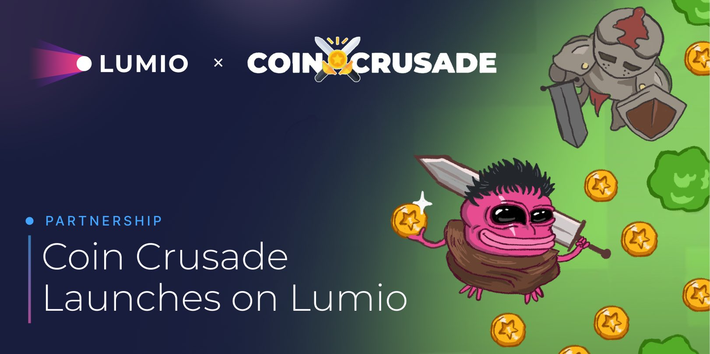

# Introduction

Lumio currently supports: Solana VM, EVM, and Aptos Move VM. With VM equivalences, Lumio enables 100% compatibility, enabling app migrations that don't require code changes.

Lumio will be integrated into the shared sequencer of popular L2s on Ethereum such as Optimism and Arbitrum to enable shared security, composability and liquidity within those ecosystems. On L1s with no L2 ecosystems such as Solana, Lumio will be deployed as a sovereign L2.

<figure><figcaption></figcaption></figure>

## Start Building

Lumio is currently represented by several L2 testnet/devnet networks, as well as a canary network on the mainnet. Before diving into development, it's important to understand the [differences between them](./#start-building).

Each network represents different versions of Lumio. Ultimately, all of these networks, including the current canary mainnet, will be merged into one unified L2 network.

## Perfomance

The VMs are optimized for peak performance and flexibility, allowing devs to reuse their code across chains.

> Achieve up to 3k TPS with <100 ms latency, scalable to a maximum of 10k TPS with the potential to expand to 30k TPS.

Read our research on the successful modifications we've implemented in the Move VM, which can also be applied to other virtual machines like the Solana VM (SVM).



## Sequencer

The sequencer works like an orchestration node which makes it possible for the altVMs to function correctly, in the same time being connected to the L1 network and processing deposit transactions, state roots, cross VM calls, and finalizing state.

## Data Availability

Lumio uses EigenDA or the L1 itself for hard finalization, with replication of community nodes for soft finalization. The rationale is that high TPS may introduce delays in transaction finalization, so employing soft commitments can expedite the process. This approach will enable the community to leverage their replication nodes and stakes to enhance the data availability of the network.

## Cross-VM Calls

The Lumio framework facilitates calls between different Virtual Machines (VMs). This is achieved through specialized smart contracts/modules, which are integral parts of the framework (Move VM, Solana) and pre-deployed smart contracts (EVM).

## Proofs

Lumio v2 supports a wide range of optimistic and zk fault proofs. We have successfully compiled Move VM into Optimism Cannon MIPS to enable the execution of optimistic proofs. Plans are underway to integrate either Arbitrum Stylus or risc0, depending on the VM and performance requirements.
